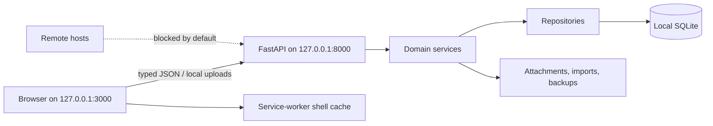
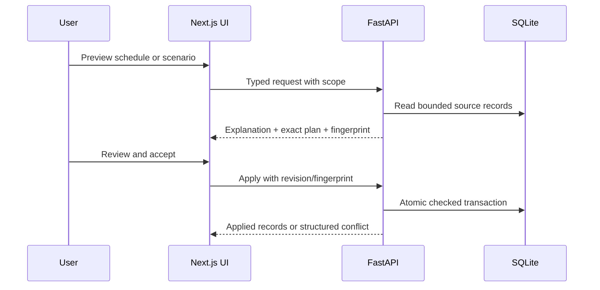

# LocalLife OS

LocalLife OS is a private, local-first browser application for coordinating tasks, projects,
calendar events, notes, finances, goals, commitments, schedules, scenarios, imports, and fixed local
automations. The FastAPI service and Next.js interface run on your device, store ordinary data in
SQLite and local files, and require no account, API key, remote database, CDN, remote font,
analytics service, or runtime AI.

The current repository is a tested hackathon MVP. It is not a hosted service and not a substitute
for professional financial, legal, medical, or security advice.

## Current status

Implemented and exercised as of 2026-07-16:

- responsive Next.js application shell with Today, tasks, calendar, notes, finance, goals,
  commitments, capacity, scenarios, timeline, imports, automation, settings, and offline routes;
- FastAPI APIs under `/api/v1`, documented by OpenAPI at
  [http://127.0.0.1:8000/docs](http://127.0.0.1:8000/docs);
- SQLite persistence through SQLModel and 11 Alembic migrations;
- deterministic commitment assessment, schedule preview/apply, and isolated scenario comparison;
- ICS and bank CSV preview/apply workflows with local-only automation rules;
- optional password-protected Argon2id + AES-256-GCM backup containers and transactional restore;
- service-worker shell caching, loopback network enforcement, telemetry disabled, and no remote
  runtime assets;
- deterministic synthetic judge data, a full critical-workflow API test, browser smoke tests,
  migration/import/backup/offline/security tests, and local performance thresholds.

No demo credentials exist. No API key is required.

## Judge quick-start

Prerequisites: Docker Desktop or another Docker Engine with Compose v2.

```bash
docker compose up --build
```

Wait until both health checks are healthy, then open
[http://127.0.0.1:3000](http://127.0.0.1:3000). Load the canonical demo from the **Scenarios** page
with **Prepare signature demo**, or call the local endpoint:

The web image creates an optimized Next.js build and runs `next start`; native `npm run dev:web`
remains the hot-reload development path.

```bash
curl -X POST http://127.0.0.1:8000/api/v1/demo/load
```

PowerShell equivalent:

```powershell
Invoke-RestMethod -Method Post -Uri http://127.0.0.1:8000/api/v1/demo/load
```

Follow [the timestamped demo script](docs/demo-script.md). Stop the services without deleting the
named data volume:

```bash
docker compose down
```

`docker compose down --volumes` also deletes the Compose data volume. Back up non-demo data first.

## Deterministic demo data

The `2026.07` dataset is anchored to 2026-07-16 and uses reserved UUIDs beginning with
`12000000`. Every person, employer, merchant, account, amount, note, and attachment is fictional.
Loading it again replaces only those reserved demo records and leaves unrelated records untouched.

The dataset contains:

- a July 2026 calendar, timed and all-day events, and two real buffer-aware conflicts;
- a synthetic salary transaction and monthly recurring salary;
- rent, groceries, utilities, transport, and two fictional subscriptions;
- a July household budget whose Food category is over its limit;
- checking and savings accounts plus an Emergency fund savings goal;
- Build Week and household projects, tasks, a subtask, and a dependency;
- daily, Build Week, and Berlin notes with a backlink and two safe attachments;
- OpenAI Build Week, Berlin conference, and Laptop purchase commitments with typed links;
- physical, remote, and skip Berlin scenarios;
- August and October laptop-purchase scenarios;
- an overdue-task note rule and a weekly local-backup reminder rule.

Native loader and reset commands, run from the repository root:

```powershell
.\apps\api\.venv\Scripts\python.exe scripts\load-demo-data.py
.\apps\api\.venv\Scripts\python.exe scripts\reset-demo-data.py
.\apps\api\.venv\Scripts\python.exe scripts\reset-demo-data.py --empty
```

POSIX:

```bash
./apps/api/.venv/bin/python scripts/load-demo-data.py
./apps/api/.venv/bin/python scripts/reset-demo-data.py
./apps/api/.venv/bin/python scripts/reset-demo-data.py --empty
```

`reset-demo-data.py` removes and reloads the reserved dataset. `--empty` removes it without
reloading. The same operations are documented local API endpoints: `POST /api/v1/demo/load` and
`POST /api/v1/demo/reset`.

Bundled import fixtures live in `data/demo/`; generated attachment copies remain confined to the
configured attachment directory.

## What the product does

### Plan work and time

Projects derive progress from linked tasks. Tasks support subtasks, priorities, estimates,
dependencies, recurrence, due dates, filters, bulk operations, and safe status transitions. The
calendar supports timed/all-day events, recurrence, move/resize, preparation/travel/recovery
buffers, accessible agenda text, and timezone-aware conflict detection.

The local OR-Tools CP-SAT scheduler treats calendar occupancy, buffers, dependencies, availability,
deadlines, and task duration as explicit constraints. Preview is non-mutating, capped by a caller
time limit, cancellable in the browser, and applied only after revision and fingerprint checks.

### Keep notes and evidence

Notes use Markdown, tags, daily dates, SQLite FTS5 search, typed entity links, note links, and
backlinks. Attachments are size-limited, hash-recorded, streamed into confined local paths, and
downloaded through the API. Unsafe filenames and traversal attempts are rejected.

### Understand money without pretending currencies are interchangeable

Finance records use integer minor units and ISO 4217 currency codes. Accounts, actual and planned
transactions, transfers, recurring rules, budgets, savings goals, subscriptions, and price-change
history remain separated by currency. Reports show explainable ledger, cash-flow, committed-balance,
spending, budget, and buffer calculations. The application performs no exchange-rate conversion.

### Assess commitments and compare scenarios

A commitment links ordinary tasks, projects, events, notes, transactions, budgets, savings goals,
and goals. Its assessment reports separate time, finance, dependency, conflict, goal, and deadline
states with warning codes, contributing records, assumptions, and suggested actions. There is no
opaque feasibility score.

Scenario mode stores typed overlays, previews exact before/after changes without modifying primary
records, compares two or three options, and applies an accepted plan atomically only when source
revisions and the preview fingerprint still match.

### Import and automate locally

ICS and CSV imports use preview-before-apply batches, fingerprints, duplicate/change detection,
row selection, reusable CSV mappings, limits, and formula-safe review exports. Automation rules use
an allow-listed trigger/action model; preview is write-free, executions are idempotent, and the
SQLite database remains authoritative.

## Architecture and data flow





Repository layout:

```text
apps/web                 Next.js application
apps/api                 FastAPI application, models, migrations, tests
packages/shared-types    generated OpenAPI TypeScript contracts
packages/ui              shared UI package
data/demo                deterministic import and attachment fixtures
docs                     architecture, domain, security, demo, submission docs
scripts                  launcher, seed/reset, verification, backup/restore tools
tests/e2e                live Playwright browser smoke
```

More detail: [architecture](docs/architecture.md),
[frontend architecture](docs/frontend-architecture.md),
[API conventions](docs/api-conventions.md), and [data model](docs/data-model.md).

## Native development

Verified prerequisites:

- Python 3.12 or later;
- Node.js 22 or later with npm;
- Chrome for the live browser smoke test.

Windows PowerShell:

```powershell
py -3.12 -m venv apps\api\.venv
.\apps\api\.venv\Scripts\python.exe -m pip install -r apps\api\requirements-dev.txt
npm ci
Push-Location apps\api
.\.venv\Scripts\python.exe -m alembic upgrade head
Pop-Location
.\scripts\locallife.ps1 doctor
.\scripts\locallife.ps1 start
```

POSIX:

```bash
python3.12 -m venv apps/api/.venv
./apps/api/.venv/bin/python -m pip install -r apps/api/requirements-dev.txt
npm ci
(cd apps/api && ./.venv/bin/python -m alembic upgrade head)
./scripts/locallife.sh doctor
./scripts/locallife.sh start
```

Open `http://127.0.0.1:3000`; stop with the matching launcher’s `stop` command. The launcher also
offers `status`, `backup`, and `restore`; see [native launcher](docs/native-launcher.md).

For separate development servers:

```powershell
Push-Location apps\api
.\.venv\Scripts\python.exe -m uvicorn app.main:app --host 127.0.0.1 --port 8000 --reload
Pop-Location
npm run dev:web
```

The frontend API base defaults to `http://127.0.0.1:8000/api/v1`. `.env.example` lists all supported
local settings. `LOCALLIFE_TELEMETRY_ENABLED=true` is rejected. Outbound Python sockets are denied
unless the explicit development-only external-request override is enabled.

## Verification and judge tests

Install native dependencies first. Run from the repository root unless a command changes directory.

Backend, migrations, lint, and types:

```powershell
.\apps\api\.venv\Scripts\python.exe -m pytest apps\api\tests -q
.\apps\api\.venv\Scripts\python.exe -m pytest apps\api\tests\test_migrations.py -q
.\apps\api\.venv\Scripts\python.exe -m ruff format --config apps\api\pyproject.toml --check apps\api scripts
.\apps\api\.venv\Scripts\python.exe -m ruff check --config apps\api\pyproject.toml apps\api scripts
.\apps\api\.venv\Scripts\python.exe -m mypy --config-file apps\api\pyproject.toml apps\api\app
```

Frontend and generated contracts:

```powershell
.\apps\api\.venv\Scripts\python.exe scripts\export-openapi.py
npm run generate:api-types
npm run typecheck:web
npm run lint:web
npm run test:web
npm run build:web
```

Critical workflow, performance, privacy, and offline checks:

```powershell
.\apps\api\.venv\Scripts\python.exe -m pytest apps\api\tests\test_judge_workflow.py -q
.\apps\api\.venv\Scripts\python.exe scripts\performance-smoke-test.py
.\apps\api\.venv\Scripts\python.exe scripts\backup-smoke-test.py
.\apps\api\.venv\Scripts\python.exe scripts\restore-smoke-test.py
.\apps\api\.venv\Scripts\python.exe scripts\check-external-assets.py
.\apps\api\.venv\Scripts\python.exe scripts\verify-offline-mode.py
npm run test:e2e:web
```

The browser smoke expects the native API and production frontend to be running and Chrome at its
normal Windows path, or `CHROME_PATH` set explicitly. It covers all application routes at 1280,
768, and 375 pixels, keyboard/dialog focus, labels, reduced motion, accessible calendar text,
synthetic demo load, scenario/commitment/timeline flows, external-request detection, and offline
service-worker reload.

The deterministic performance smoke uses a temporary database and enforces 250 ms for health,
1 second for common conflict/timeline APIs, and 2 seconds for three-way scenario comparison. The
maximum scheduling benchmark separately covers 100 tasks, 200 events, and a 30-day horizon with a
one-second solver bound.

## Accessibility

The UI uses semantic controls, associated labels, visible focus rings, dialog focus trapping and
return, live alert/toast regions, textual status labels, reduced-motion styles, chart tables/lists,
and an agenda-based calendar alternative. The live browser smoke checks keyboard navigation,
dialog focus, unlabeled form controls, accessible alternatives, and responsive overflow.

Automated Axe integration is not currently installed. It was attempted for submission verification
but the development environment blocked the package download before installation. Automated checks
do not replace keyboard and screen-reader testing; a manual assistive-technology pass remains a
known limitation.

## Privacy and security summary

- API and web ports bind explicitly to `127.0.0.1` outside containers.
- CORS, Origin, Host, and configured API-base validation allow loopback hosts only.
- Runtime telemetry is disabled and remote fonts/assets are absent.
- The Python service has a default-deny outbound socket guard.
- Service-worker caches exclude API responses, non-GET requests, and cross-origin resources.
- Attachments, imports, runtime files, and backups are confined under the configured data directory.
- Imports have filename, extension, byte, row, encoding, formula, and traversal safeguards.
- Backup manifests include schema metadata and per-file SHA-256 checksums. Password-protected
  backups use Argon2id key derivation and AES-256-GCM authenticated encryption.
- Restore verifies authentication, checksums, schema compatibility, and SQLite integrity, creates a
  safety backup, and rolls back failed activation.

Important limitations: the live SQLite database and ordinary attachment/import files are plaintext;
only explicitly password-protected `.llbackup` files are encrypted. The privacy screen is a casual
screen lock, not authentication. Anyone with operating-system access to the data directory can read,
change, copy, or delete local data. Keep the device account and disk protected. See
[privacy](docs/privacy.md), [security](docs/security.md), and [threat model](docs/threat-model.md).

## Supported platforms

- Docker Compose: verified with Linux-based API/web images on Docker Desktop for Windows.
- Native Windows: verified with PowerShell, Python, Node.js, Chrome, and the launcher.
- Native Linux/macOS: POSIX scripts and commands are provided, but this release was not exercised on
  a separate Linux or macOS host. The POSIX API entrypoint was exercised inside Debian containers.
- The browser UI targets current Chromium-based desktop browsers. Firefox, WebKit, mobile devices,
  and screen readers have not received full release-matrix testing.

## Known limitations and non-goals

- Single local workspace and no multi-user synchronization, remote authentication, or cloud backup.
- No live bank, calendar-provider, exchange-rate, messaging, or AI integration.
- No runtime natural-language automation or autonomous advisory agent.
- No at-rest encryption for the live database or ordinary data directories.
- Scenario projections use present local records and explicit assumptions; they are not forecasts.
- The scheduler is bounded optimization, not a promise that every task can or should be scheduled.
- Import support is intentionally conservative and does not cover every bank export or ICS extension.
- Automated Axe scanning and a broad non-Chromium/browser assistive-technology matrix remain open.
- Fresh production-image Compose build/health and the extended desktop/tablet/compact Chrome flow
  were verified in the final review on 2026-07-18.

No unresolved critical `TODO` marker is present in a user-facing runtime path at submission time.

## Screenshots

Submission screenshots are intentionally left as capture placeholders because generated browser-smoke
artifacts are not committed:

1. **Today dashboard** — capture after loading `2026.07` demo data.
2. **Berlin attendance comparison** — capture the physical/remote/skip three-way view.
3. **Commitment relationship graph** — capture the Berlin conference graph.
4. **Offline proof** — capture the cached shell with the offline banner visible.

The E2E command writes fresh local screenshots under `data/browser-smoke-artifacts/`.

## Codex and GPT-5.6

Codex and GPT-5.6 accelerated repository inspection, architecture decomposition, typed API/service
implementation, migrations, UI composition, adversarial tests, test-data construction, security
review, and verification scripting. Human-reviewed decisions include the no-runtime-AI boundary,
local-only network model, explainable commitment outputs, currency separation, preview-before-apply
mutations, encryption claims, and documented platform limitations. See the
[development log](docs/codex-development-log.md) and
[hackathon submission draft](docs/hackathon-submission.md).

## Troubleshooting

**A port is occupied.** Run `scripts/locallife.ps1 doctor` or `scripts/locallife.sh doctor`, stop the
other process, or keep LocalLife on its documented ports. The launcher refuses to take over an
unrelated listener.

**The UI says the local service is unavailable.** Confirm
`http://127.0.0.1:8000/api/v1/health`, check `NEXT_PUBLIC_API_BASE_URL`, and keep the hostname on
`127.0.0.1` or `localhost`.

**Docker data ownership is stale.** Rebuild and restart; the API entrypoint performs its one-time
named-volume ownership migration before dropping privileges.

**A migration warning mentions an implicit SQLite constraint.** One historical migration produces
an Alembic warning because SQLite cannot add an implicit constraint with ordinary `ALTER`. The
repository migration and schema-drift tests are authoritative and currently pass.

**Offline reload fails on first use.** Visit the online application once and wait for the service
worker to activate before disconnecting. API data is never served from the shell cache.

**Restore is refused.** Use the correct password and the same application schema version. Run
`inspect`/preview through the launcher and preserve the automatically created safety backup.

## Documentation

- [Three-minute demo](docs/demo-script.md)
- [Hackathon submission](docs/hackathon-submission.md)
- [Demo workflow](docs/demo-flow.md)
- [Architecture](docs/architecture.md)
- [API conventions](docs/api-conventions.md)
- [Data model](docs/data-model.md)
- [Commitment engine](docs/commitment-engine.md)
- [Scheduling engine](docs/scheduling-engine.md)
- [Scenario engine](docs/scenario-engine.md)
- [Imports and automation](docs/imports-and-automation.md)
- [Backup format](docs/backup-format.md)
- [Implementation status](docs/implementation-status.md)

## License

MIT License. See [LICENSE](LICENSE).
