# Data model

## Persistence principles

The LocalLife OS domain is stored in local SQLite and created entirely by Alembic. Domain IDs are
UUIDs. Tables carry UTC `created_at` and `updated_at` values; user-editable records also carry a
positive `revision`. Content records use `deleted_at` where recovery and historical links are
useful, while relationship rows are deleted directly.

Money uses integer minor units and validated ISO 4217 currency codes. Task and event recurrence
retains the typed frequency columns introduced in Prompt 2 and adds a canonical iCalendar-compatible
RRULE used for expansion. Notes retain Markdown source and an optional daily-note date; SQLite FTS5
indexes active content. Attachment rows contain safe generated paths relative to
`data/attachments`, never arbitrary host paths.

Finance distinguishes posted ledger facts from planned occurrences. Recurring finance rules and
subscriptions use canonical RRULE values. Reports derive balances and projections from these source
records instead of persisting mutable totals, and never combine currencies through an implicit rate.

Commitment assessments are also derived rather than persisted. A commitment stores user intent and
optional time/financial constraints; typed links identify the current source records collected for
an assessment. Calculation responses contain traceable entity references but no cached feasibility
score.

Scheduling advice is persisted separately from primary task and calendar rows. A scheduling
preview stores its bounded request, response, source-revision snapshot, SHA-256 fingerprint,
expiry, and optional applied timestamp. The preview is an audit and concurrency artifact, not a
second task schedule.

## Entity relationship diagram

```mermaid
erDiagram
    WORKSPACE ||--|| USER_PREFERENCES : has
    WORKSPACE ||--o{ TAG : owns
    WORKSPACE ||--o{ ATTACHMENT : owns
    WORKSPACE ||--o{ TIMELINE_EVENT : records
    WORKSPACE ||--o{ PROJECT : owns
    WORKSPACE ||--o{ TASK : owns
    WORKSPACE ||--o{ NOTE : owns
    WORKSPACE ||--o{ CALENDAR_EVENT : owns
    WORKSPACE ||--o{ FINANCIAL_ACCOUNT : owns
    WORKSPACE ||--o{ TRANSACTION_CATEGORY : owns
    WORKSPACE ||--o{ PLANNED_TRANSACTION : owns
    WORKSPACE ||--o{ RECURRING_TRANSACTION_RULE : owns
    WORKSPACE ||--o{ SUBSCRIPTION : owns
    WORKSPACE ||--o{ BUDGET : owns
    WORKSPACE ||--o{ SAVINGS_GOAL : owns
    WORKSPACE ||--o{ COMMITMENT : owns
    WORKSPACE ||--o{ GOAL : owns
    WORKSPACE ||--o{ AUTOMATION_RULE : owns
    WORKSPACE ||--o{ SCENARIO : owns
    WORKSPACE ||--o{ SCHEDULING_PREVIEW : owns

    PROJECT o|--o{ TASK : groups
    TASK o|--o{ TASK : parent_of
    TASK ||--o{ TASK_DEPENDENCY : dependent
    TASK ||--o{ TASK_DEPENDENCY : prerequisite
    NOTE ||--o{ NOTE_LINK : source
    NOTE ||--o{ NOTE_LINK : target
    NOTE ||--o{ NOTE_ENTITY_LINK : links
    CALENDAR_EVENT ||--o{ CALENDAR_EVENT_ENTITY_LINK : links

    FINANCIAL_ACCOUNT ||--o{ TRANSACTION : source
    FINANCIAL_ACCOUNT o|--o{ TRANSACTION : transfer_destination
    TRANSACTION_CATEGORY o|--o{ TRANSACTION : categorizes
    FINANCIAL_ACCOUNT ||--o{ PLANNED_TRANSACTION : source
    TRANSACTION_CATEGORY o|--o{ PLANNED_TRANSACTION : categorizes
    RECURRING_TRANSACTION_RULE o|--o{ PLANNED_TRANSACTION : generates
    SUBSCRIPTION o|--o{ PLANNED_TRANSACTION : schedules
    SUBSCRIPTION ||--o{ SUBSCRIPTION_PRICE_CHANGE : records
    FINANCIAL_ACCOUNT ||--o{ SUBSCRIPTION : charges
    FINANCIAL_ACCOUNT o|--o{ SAVINGS_GOAL : tracks
    BUDGET ||--o{ BUDGET_CATEGORY_LIMIT : contains
    TRANSACTION_CATEGORY ||--o{ BUDGET_CATEGORY_LIMIT : limits

    TAG ||--o{ TAG_ENTITY_LINK : has
    ATTACHMENT ||--o{ ATTACHMENT_ENTITY_LINK : has
    COMMITMENT ||--o{ COMMITMENT_ENTITY_LINK : has
    COMMITMENT o|--o{ SCHEDULING_PREVIEW : scopes
    SCENARIO ||--o{ SCENARIO_CHANGE : overlays

    WORKSPACE {
        uuid id PK
        string name
        boolean is_default
        int revision
        datetime deleted_at
    }
    USER_PREFERENCES {
        uuid id PK
        uuid workspace_id FK
        string timezone
        string locale
        string currency_code
        int revision
    }
    TASK {
        uuid id PK
        uuid workspace_id FK
        uuid project_id FK
        uuid parent_task_id FK
        string status
        string priority
        int estimated_duration_minutes
        int actual_duration_minutes
        datetime completed_at
        datetime earliest_start_at
        datetime due_at
        string preferred_time_of_day
        datetime scheduled_start_at
        datetime scheduled_end_at
        string recurrence_frequency
        string recurrence_rrule
        int revision
    }
    NOTE {
        uuid id PK
        uuid workspace_id FK
        string title
        text markdown
        date daily_note_date
        int revision
    }
    CALENDAR_EVENT {
        uuid id PK
        uuid workspace_id FK
        boolean all_day
        datetime starts_at
        datetime ends_at
        date all_day_start
        date all_day_end
        string timezone
        string category
        string recurrence_frequency
        string recurrence_rrule
        int preparation_buffer_minutes
        int travel_buffer_minutes
        int recovery_buffer_minutes
        int revision
    }
    NOTE_ENTITY_LINK {
        uuid id PK
        uuid note_id FK
        string entity_type
        uuid entity_id
        string label
    }
    CALENDAR_EVENT_ENTITY_LINK {
        uuid id PK
        uuid calendar_event_id FK
        string entity_type
        uuid entity_id
    }
    TRANSACTION {
        uuid id PK
        uuid account_id FK
        uuid transfer_account_id FK
        uuid category_id FK
        string transaction_type
        int amount_minor
        string currency_code
        datetime occurred_at
        string import_fingerprint
        int revision
    }
    PLANNED_TRANSACTION {
        uuid id PK
        uuid account_id FK
        uuid recurring_rule_id FK
        uuid subscription_id FK
        uuid actual_transaction_id FK
        string transaction_type
        int amount_minor
        string currency_code
        datetime planned_for
        string status
        boolean is_committed
        string occurrence_key
        int revision
    }
    RECURRING_TRANSACTION_RULE {
        uuid id PK
        uuid account_id FK
        uuid subscription_id FK
        string transaction_type
        int amount_minor
        string currency_code
        string rrule
        datetime starts_at
        string status
        boolean is_committed
        int revision
    }
    SUBSCRIPTION {
        uuid id PK
        uuid account_id FK
        uuid category_id FK
        int amount_minor
        string currency_code
        string billing_rrule
        datetime starts_at
        string status
        int revision
    }
    BUDGET_CATEGORY_LIMIT {
        uuid id PK
        uuid budget_id FK
        uuid category_id FK
        int limit_minor
    }
    COMMITMENT_ENTITY_LINK {
        uuid id PK
        uuid commitment_id FK
        string entity_type
        uuid entity_id
        string role
    }
    COMMITMENT {
        uuid id PK
        uuid workspace_id FK
        string title
        string status
        string category
        datetime starts_at
        datetime ends_at
        datetime decision_deadline_at
        int estimated_duration_minutes
        int financial_buffer_requirement_minor
        string currency_code
        int revision
    }
    SCHEDULING_PREVIEW {
        uuid id PK
        uuid workspace_id FK
        uuid commitment_id FK
        datetime horizon_start_at
        datetime horizon_end_at
        string solver_status
        string source_fingerprint
        json source_snapshot
        json request_payload
        json result_payload
        datetime expires_at
        datetime applied_at
        int revision
    }
    SCENARIO_CHANGE {
        uuid id PK
        uuid scenario_id FK
        string entity_type
        uuid entity_id
        string operation
        json changes
        int revision
    }
```

The diagram abbreviates repeated audit fields and several leaf entity attributes for readability.
Every domain table is workspace-scoped directly or through its owning row.

## Normalized and typed links

`TagEntityLink`, `AttachmentEntityLink`, `CommitmentEntityLink`, `NoteEntityLink`, and
`CalendarEventEntityLink` use an `entity_type` plus UUID to link across domains without adding
nullable foreign-key columns for every possible target. Their services validate target type,
existence, active state, and workspace before writing. Composite uniqueness constraints prevent
duplicate typed links. Deleting one of these link rows has no cascade path to its target.

Commitment links support projects, tasks, calendar events, notes, planned transactions, posted
transactions, budgets, savings goals, and general goals. Archived commitments retain relationship
rows and reject direct link changes. Source-resource deletion services remove any relationship rows
that would otherwise point at a deleted target; deleting the commitment removes all of its links.

Task dependencies and note links use concrete foreign keys because both ends have one fixed type.
They reject self-links and duplicates. Budget category limits normalize the many-to-many relation
between budgets and transaction categories and store the integer limit on the relationship.

## Transactions and recurrence

Transactions store a positive magnitude and an explicit `income`, `expense`, or `transfer` type.
Transfers require a different destination account, omit categories, and are accepted only when
both accounts share a currency. Income and expense categories are checked against their matching
category kind in the service layer.

Account balances are derived from opening balance and posted transaction effects. An optional
non-negative financial buffer is compared with the derived or effectively available balance.
Workspace-scoped import fingerprints prevent duplicate actual and planned imports. Transfers remain
one row with two effects so creation is atomic and cash-flow neutrality is unambiguous.

Planned transactions do not affect the ledger. Fulfillment creates one posted transaction and links
it back under the same transaction boundary. Recurring transaction rules generate plans with a
unique rule/UTC-occurrence key, so an identical generation range is idempotent. Subscription amount
updates append immutable price-change rows. Savings goals may link one account only when currencies
match.

## Commitment calculations

The commitment row reuses `starts_at`, `ends_at`, and `estimated_duration_minutes` as the persistent
target start, target end, and manual time-capacity requirement; the API exposes the clearer target
and capacity names. The optional financial-buffer requirement is paired with a validated currency.
Migration `20260715_0006` adds those fields, the category and decision deadline, the archived
lifecycle status, and the expanded link types.

Collectors resolve active link targets and load dependency, conflict, account-ledger, and budget
evidence. Evaluators derive time, money, dependency, schedule, goal, and deadline impact from that
evidence at request time. No assessment, warning, aggregate status, or timeline summary is stored as
a mutable cache. See [commitment-engine.md](commitment-engine.md) for formulas and warning rules.

## Scheduling previews

Migration `20260715_0007` adds task earliest-start and preferred-time fields plus the
`scheduling_previews` table. A task's due time and a linked commitment target end can both constrain
the solver; the earliest applicable deadline wins. Preferred time uses a stable enum and remains a
soft input.

The scheduling preview keeps JSON request and result payloads so explanations are reproducible for
the preview that the user saw. Its source snapshot contains revisions and constraint-defining
values for selected tasks, prerequisites, overlapping existing scheduled tasks, calendar events,
workspace preferences, and an optional commitment. Apply recollects those sources and compares the
canonical SHA-256 fingerprint. It then uses each placement's expected task revision in the same
transaction as all task updates, timeline events, and the preview's applied timestamp.

Preview rows are workspace-owned, may optionally reference a commitment with `ON DELETE SET NULL`,
and expire according to local configuration. They do not foreign-key every selected task because
the immutable source and result payloads describe a bounded multi-entity solve. See
[scheduling-engine.md](scheduling-engine.md) for the optimization and capacity contract.

Tasks and calendar events store a canonical RRULE rather than opaque prose. The typed frequency,
interval, weekday (`0` through `6`), and end columns remain populated for typed recurrence input;
direct RRULE input leaves those compatibility/query columns null. An absent recurrence uses SQL
`NULL` in every recurrence column. Expansion uses `python-dateutil` and is bounded to 1,000 results.

## Full-text search and local files

The `notes_fts` FTS5 virtual table is migration-managed. Insert, update, soft-delete, and physical
delete triggers synchronize active note title and Markdown content. FTS5 shadow tables are SQLite
implementation details and are excluded from Alembic metadata drift comparisons.

Attachment content is stored outside SQLite beneath the configured local attachment root. The
database stores generated relative path, original display filename, media type, byte size, and
SHA-256. Soft-deleting a linked task, note, or event retains the attachment association and bytes;
explicit attachment deletion removes links and local content.

## Scenario isolation

A `Scenario` does not clone or edit primary tables. Each `ScenarioChange` records one typed target,
an operation (`create`, `update`, or `delete`), and a JSON patch. Supported projections cover tasks,
calendar events, planned transactions, commitments, and goals. Preview builds detached copies in
memory, applies the patches, calculates comparable time, finance, conflict, goal, and commitment
metrics, and persists neither the projection nor any primary-record mutation.

Each update patch captures the target revision in `__expected_revision`. Preview returns an exact
ordered change plan, a source fingerprint, and an explicit stale state when a target has moved or
disappeared. Acceptance requires the preview fingerprint and revalidates every source revision in
one transaction before applying the plan. Discard only changes scenario lifecycle state. These
rules keep exploratory branches isolated until the user explicitly reviews and accepts one.

## Seed data

Startup seeds one deterministic default workspace, one preferences row, the timezone system
setting, and deterministic income/expense categories. Seeding is idempotent and runs only after
Alembic reaches the current head.
